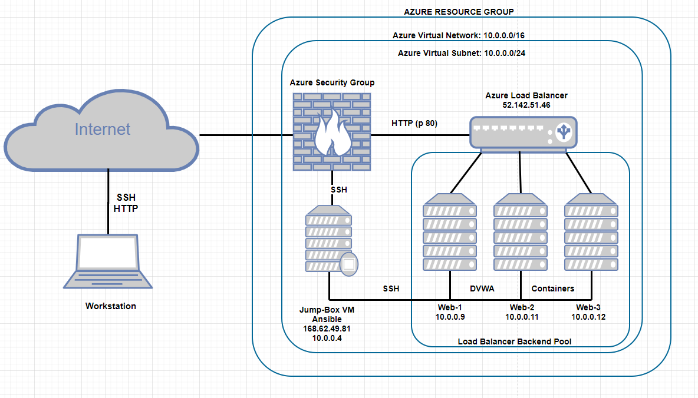
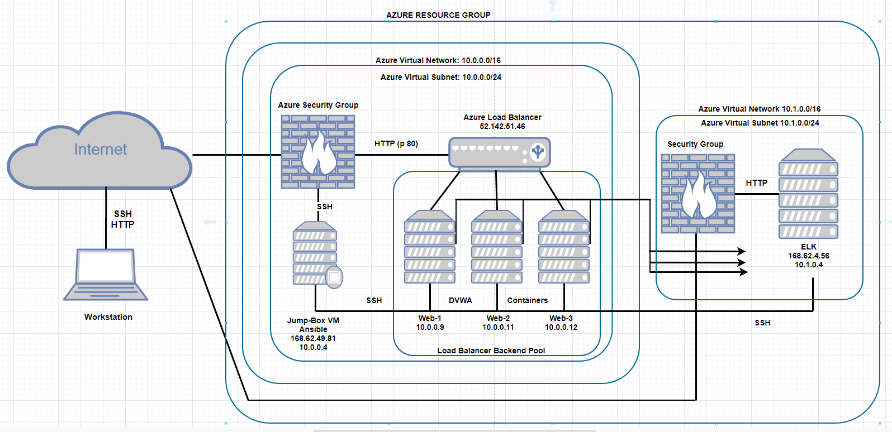

## Cloud Architecture and Deployment

During the configuration of a cloud Network and ELK server from my cyberclass the files in this repository was used.

Using the azure portal for this configuration and deployment, a resource group was first created that contained all that the other resources that were created later on used.
Next was to create the Virtual network which enabled the Virtual machines we created afterwards communicate securely with each other. Before creating the virtual machines, I created a Network security group which was added to my resource group. The network security group is important because that's were the inbound and outbaound rules are set to secure the network.
I created 4 VMs, the first was the "Jumpbox" which ran the Docker containers while the other 3 VMs were Web-VMs running vulnerable DVWA containers.

**Cloud Security Topology**:

**Note**: All resources were created and deployed in the same availability region.

### ELK (Elasticsearch, Logstash, and Kibana) Server

Using the azure portal again I added an instance of the ELK stack to a new virtual network in a different region and configured the 3 Web VMs previously configured to send logs to it.
I took the following steps to set-up the ELK server:

- This ELK server was created under the same resource group as the previous VMs but I created a new virtual network in a new region.
- I then created a peer-to-peer network connection between the two VNets.
- I now created a new VM with 8GiB memory within the new network.
- The ELK stack Docker container was downloaded and configured on the new VM.
- I installed Metricbeat and Filebeat on the web-DVWA-VMs.
- Finally after all the configuration, on Kibana(a tool for visualizing Elasticsearch data with charts and graphs) I checked to see if the ELK stack was receiving data from the 3 VMs and it was.

**ELK Server Topology**

